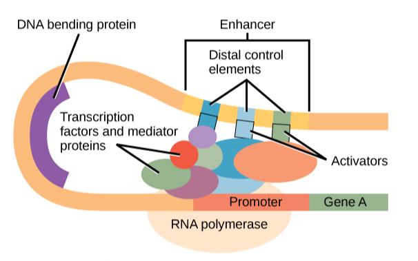
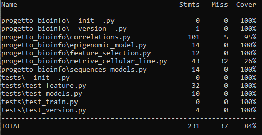

Predizione delle regioni regolatorie attive in specifiche linee cellulari tramite metodi di deep learning

=========================================================================================
|travis| |sonar_quality| |sonar_maintainability| |codacy|
|code_climate_maintainability|

progetto corso

How do I install this package?
----------------------------------------------
As usual, just download it using pip:

.. code:: shell

    pip install progetto_bioinfo

Tests Coverage
----------------------------------------------

progetto corso

.. |travis| image:: https://travis-ci.org/caputoalessia/progetto_bioinfo.png
   :target: https://travis-ci.org/caputoalessia/progetto_bioinfo
   :alt: Travis CI build

.. |sonar_quality| image:: https://sonarcloud.io/api/project_badges/measure?project=caputoalessia_progetto_bioinfo&metric=alert_status
    :target: https://sonarcloud.io/dashboard/index/caputoalessia_progetto_bioinfo
    :alt: SonarCloud Quality

.. |sonar_maintainability| image:: https://sonarcloud.io/api/project_badges/measure?project=caputoalessia_progetto_bioinfo&metric=sqale_rating
    :target: https://sonarcloud.io/dashboard/index/caputoalessia_progetto_bioinfo
    :alt: SonarCloud Maintainability

.. |sonar_coverage| image:: https://sonarcloud.io/api/project_badges/measure?project=caputoalessia_progetto_bioinfo&metric=coverage
    :target: https://sonarcloud.io/dashboard/index/caputoalessia_progetto_bioinfo
    :alt: SonarCloud Coverage

.. |coveralls| image:: https://coveralls.io/repos/github/caputoalessia/progetto_bioinfo/badge.svg?branch=master
    :target: https://coveralls.io/github/caputoalessia/progetto_bioinfo?branch=master
    :alt: Coveralls Coverage

.. |pip| image:: https://badge.fury.io/py/progetto-bioinfo.svg
    :target: https://badge.fury.io/py/progetto-bioinfo
    :alt: Pypi project

.. |downloads| image:: https://pepy.tech/badge/progetto-bioinfo
    :target: https://pepy.tech/project/progetto-bioinfo
    :alt: Pypi total project downloads

.. |codacy| image:: https://api.codacy.com/project/badge/Grade/4bf587d085184deb92f08912b8c2abaa
    :target: https://www.codacy.com/manual/caputoalessia/progetto_bioinfo?utm_source=github.com&amp;utm_medium=referral&amp;utm_content=caputoalessia/progetto_bioinfo&amp;utm_campaign=Badge_Grade
    :alt: Codacy Maintainability

.. |code_climate_maintainability| image:: https://api.codeclimate.com/v1/badges/10efe5e6084fa14e8a3b/maintainability
    :target: https://codeclimate.com/github/caputoalessia/progetto_bioinfo/maintainability
    :alt: Maintainability

.. |code_climate_coverage| image:: https://api.codeclimate.com/v1/badges/10efe5e6084fa14e8a3b/test_coverage
    :target: https://codeclimate.com/github/caputoalessia/progetto_bioinfo/test_coverage
    :alt: Code Climate Coverage
